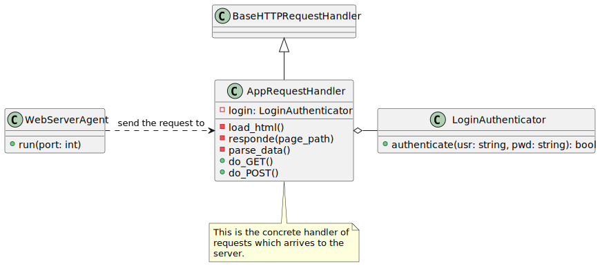
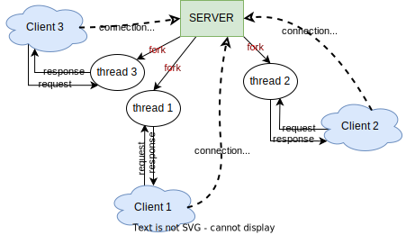

<div style="text-align: center">
    <h1>Web Server</h1>
    <h2>Relazione di progetto di 'Programmazione di reti'</h2>
    <p>Tassinari Luca &bull; Matr. 921373</p>
</div>

- [1. Analisi dei requisiti](#1-analisi-dei-requisiti)
- [2. Design](#2-design)
  - [2.1. Design dettagliato](#21-design-dettagliato)
- [3. Librerie utilizzate](#3-librerie-utilizzate)
- [4. Come avviare l'applicazione?](#4-come-avviare-lapplicazione)

## 1. Analisi dei requisiti
Si vuole realizzare un _web server_ per un'agenzia di viaggi. 
Di seguito sono elencati per punti i requisiti del sistema:
- il _web server_ deve consentire l'accesso a più utenti in contemporanea;
- la _home page_ del sito deve permettere la visualizzazione della lista di servizi erogati dall'agenzia viaggi (con relativo _link_ ad una pagina dedicata);
- devono esserci la possibilità d'inserire _link_ per il _download_ di documenti pdf;
- si richiede la possibilità di autenticare gli utenti;
- l'interruzione da tastiera dell'esecuzione del _web server_ deve essere opportunamente gestita in modo da liberare la risorsa _socket_.

## 2. Design 
L'architettura del sistema è molto semplice ed è presenta qui di seguito.



- `WebServerAgent` è il componente attivo che si occupa dell'istanziazione e configurazione del server web. 
- `AppRequestHandler` è la classe che si occupa della gestione delle richieste HTTP che arrivano al server web dai vari _client_. Si noti che questa classe estende [`BaseHTTPRequestHandler`](https://docs.python.org/3/library/http.server.html#http.server.BaseHTTPRequestHandler), definita all'interno del modulo `http.server`, implementando la logica delle risposte all'interno dei due metodi `do_GET()` e `do_POST()`. 
- `LoginAuthenticator`: classe che si occupa dell'autenticazione all'area riservata del sito web.

### 2.1. Design dettagliato
Per permettere al server di gestire più client in contemporanea è necessario fare uso di più _thread_, uno per ciascun _client_: in particolare, per ogni _client_ che si connette al _web server_, il _server_ crea un nuovo _thread_ il cui compito è quello di rispondere al _client_; una volta esaurito il suo compito, termina. 



A tale scopo si fa uso della funzione `ThreadingTCPServer` (all'interno del modulo `http.server`) a cui viene passato il concreto _handler_ che dovrà gestire le richieste di ciascun _client_ (nel caso specifico `AppRequestHandler`).

I due metodi `do_GET()` e `do_POST()` definiscono la logica di gestione per le richieste, rispettivamente, GET e POST. 

In generale, le richieste GET vengono gestite controllando che la risorsa richiesta esista, restituendola laddove presente oppure restituendo una pagina di _default_ di errore (`not-found.html`).

La richiesta POST è implementata per effettuare l'autenticazione al sito: quando l'utente compila ed effettua il _submit_ del _form_ viene inviata una richiesta POST. 
Si ricorda che nella richiesta POST le informazioni sono incapsulate all'interno del _body_ della richiesta HTTP e non direttamente visibili nell'URL. 
Questo, tuttavia, **non** significa che la trasmissione dei dati è sicura in quanto è in chiaro (e potrebbe pertanto essere intercettata)!

La gestione della richiesta POST è, anch'essa, piuttosto semplice: viene fatto il parsing per ottenere i dati di autenticazione a seconda del tipo di _encoding_ con cui i dati sono stati inviati al server (`application/x-www-form-urlencoded` (default) in cui tutti i caratteri vengono codificati prima dell'invio o `multipart/form-data` se vengono inviati _file_) e se la pagina _target_ della richiesta è quella di amministratore, attraverso il `LoginAuthenticator`, viene effettuato un nuovo tentativo di accesso.

`LoginAuthenticator` effettua banalmente il controllo della corrispondenza tra le credenziali immesse dall'utente nel _form_ e quelle presenti nel sistema (recuperandole dal file `login.json` - approccio sicuramente non sicuro!).

Di seguito un diagramma di sequenza che mostra un esempio di possibile interazione con il _web server_:


Per quanto riguarda la richiesta di poter scaricare file PDF è sufficiente aggiungere nell'HTML un link alla risorsa specificata (in locale).

## 3. Librerie utilizzate
Nell'implementazione sono state usati i seguenti moduli:
- `socketserver` per la gestione multi-thread del _web server_;
- `http` per l'_Handler_ delle richieste;
- `sys` per gli argomenti da riga di comando;
- `cgi` per il parsing degli argomenti passati nel body della richiest POST HTTP;
- `json` per l'estrazione delle credenziali (scritte in file JSON).

## 4. Come avviare l'applicazione?
Semplicemente (dalla _route_ del progetto):
```
python3 ./app.py [port_number]
```
dove `port_number` è il numero della porta su cui il server rimane in ascolto. Se non specificato il default è `8080`.